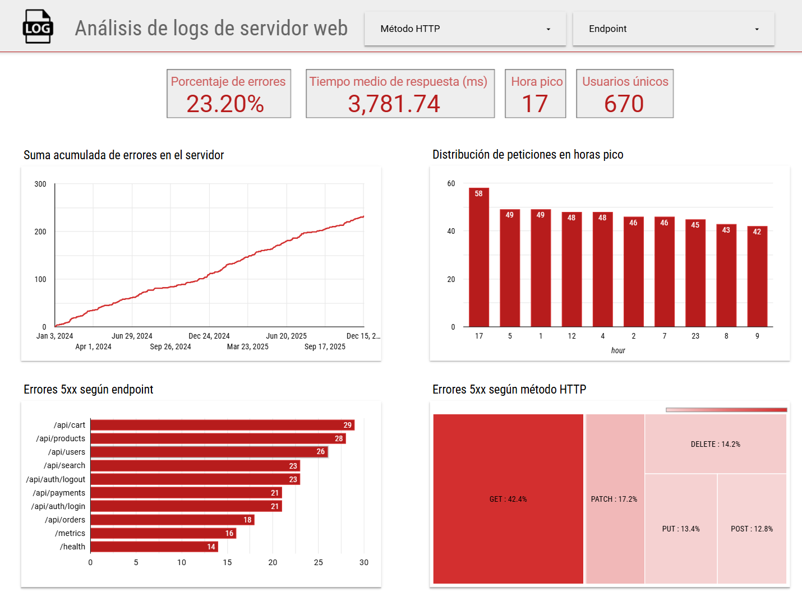

# Análisis de Logs de Servidor Web

Diagnóstico de rendimiento y disponibilidad de un servidor web mediante análisis SQL sobre 1,000 registros de acceso. El análisis reveló una **tasa de errores 5xx del 23.2%** y latencias promedio superiores a 3,700ms, identificando los endpoints críticos que requieren intervención inmediata.



[Ver dashboard en alta calidad (PDF)](results/visualizaciones/server_logs_analysis_dashboard.pdf)

[Ver dashboard en fuente original (Looker Studio)](https://lookerstudio.google.com/reporting/95f3a788-5e87-436f-a66d-9083c20b9850)

## Hallazgos Clave

| Métrica | Valor |
|---------|-------|
| Tasa de errores 5xx | **23.2%** (232 de 1,000 requests) |
| Endpoints con error rate >20% | **9 de 11** |
| Latencia promedio | **3,781 ms** |
| Hora pico de tráfico | **17:00** (58 requests) |
| Usuarios únicos afectados | **670** |

### Endpoints Críticos Identificados

- `/api/cart` — 29.59% error rate, 4,762ms latencia
- `/api/users` — 28.26% error rate, 4,161ms latencia  
- `/api/products` — 26.42% error rate, 4,765ms latencia

Estos tres endpoints concentran el **35.78% de todos los errores 5xx** y representan el core transaccional de la aplicación.

---

## Stack Tecnológico

**Python 3.13** · **DuckDB** · **Jupyter Notebooks** · **Looker Studio**

## Estructura del Proyecto

```
├── data/               # Datos fuente (JSON) - ignorado por git
├── notebooks/          # Análisis exploratorio
├── sql/                # Queries documentadas
└── results/            # Hallazgos y visualizaciones
```

---

## Documentación

- [Plan de Acción Detallado](results/HALLAZGOS.md) — Diagnóstico completo con recomendaciones técnicas

---

**Autor:** Gerardo Toboso · [gerardotoboso1909@gmail.com](mailto:gerardotoboso1909@gmail.com)  
**Licencia:** MIT